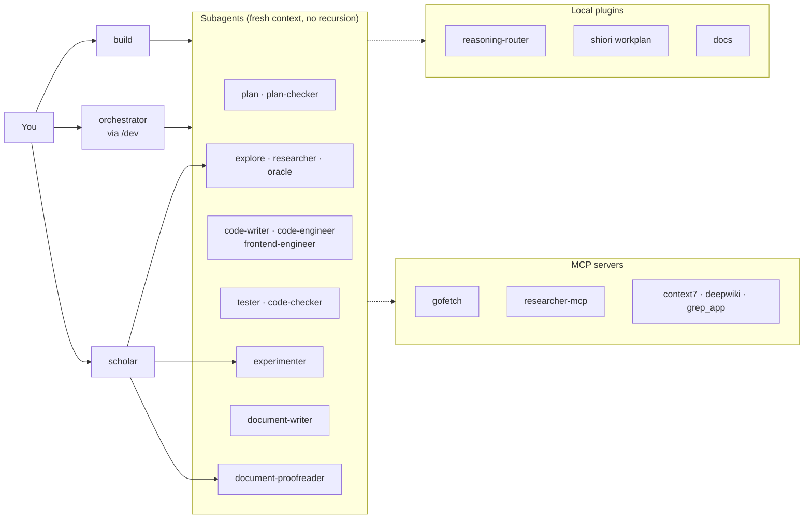

<div align="center">

# hoshi-opencode2

**A personal OpenCode 2 configuration: agents, skills and local plugins for coding, research and writing.**

*Lives in `~/.config/opencode`. Targets OpenCode 2 only.*

[](https://opencode.ai)
[](package.json)
[](LICENSE)

[Features](#features) · [Architecture](#architecture) · [Quick start](#quick-start) · [Security](#security) · [Development](#development)

</div>

> **Agents do the work. The configuration owns the boundaries.**
>
> Models, reasoning effort, tool permissions and delegation rules are declared here, not improvised per session. Every agent gets only the tools its role needs.

> [!NOTE]
> OpenCode 1 plugins are not loaded. Workplan tools are served by [Shiori](https://github.com/hoshinoht/shiori) (`vendor/shiori`), a Go core with an OpenCode adapter.

## At a glance

| | |
| --- | --- |
| **Entry points** | `build` (default) for everyday work · `/dev` for orchestrated features · `scholar` for papers |
| **Agents** | 17: 4 primary, 1 dual-mode (`plan`), 12 subagents, each with generated least-privilege permissions |
| **Plugins** | reasoning-router · model-presets · openai-long-context · usage-tracker · shiori (workplan) · cache-guard · docs |
| **MCP servers** | gofetch · researcher-mcp · context7 · deepwiki · grep_app · lsp-tools |
| **Skills** | 13 [Agent Skills](https://agentskills.io), most of them platform-agnostic |

## Features

### Workflows

| You want | Use | What happens |
| --- | --- | --- |
| an everyday fix or question | `build` | works directly; delegates only when it clearly helps |
| a feature or larger change | `/dev <request>` | `orchestrator` plans, delegates, reviews and verifies |
| a review of your diff | `/review` | adversarial review split across `code-checker` workers |
| to optimise a measurable number | `/autoresearch <goal + metric>` | `experimenter` iterates on an isolated branch, keeping or reverting each change |
| a paper for a venue | `scholar` | native LaTeX with the official class (`IEEEtran`, `acmart`, ...) |
| a report or styled PDF | `document-writer` | pandoc drafts through the `docs_*` tools |

Durable workplans are reserved for cross-session, multi-owner, migration or high-risk work. See [docs/workflows.md](docs/workflows.md).

### Agents

| Agent | Mode | Model |
| --- | --- | --- |
| `build` | primary (default) | `openai/gpt-6.1-sol-1m#high` |
| `orchestrator` | primary | `openai/gpt-6.1-sol-1m#high` |
| `scholar` | primary | `openai/gpt-5.6-terra-1m#high` |
| `ats-tailor` | primary (hidden) | `openai/gpt-5.6-terra-1m#high` |
| `plan` | all | `openai/gpt-6.1-sol-1m#high` |
| `plan-checker` | subagent | `openai/gpt-6.1-sol-1m#high` |
| `explore` | subagent | `openai/gpt-6-luna#low` |
| `researcher` | subagent | `openai/gpt-5.6-terra-1m#medium` |
| `code-writer` | subagent | `openai/gpt-6-luna-1m#max` |
| `code-engineer` | subagent | `openai/gpt-5.6-terra-1m#high` |
| `frontend-engineer` | subagent | `openai/gpt-5.6-terra-1m#medium` |
| `tester` | subagent | `openai/gpt-6-luna#low` |
| `experimenter` | subagent | `openai/gpt-5.6-terra-1m#high` |
| `code-checker` | subagent | `openai/gpt-5.6-terra-1m#medium` |
| `oracle` | subagent | `openai/gpt-6-astra#low` |
| `document-writer` | subagent | `openai/gpt-5.6-terra-1m#medium` |
| `document-proofreader` | subagent | `openai/gpt-5.6-terra-1m#medium` |

Roles, built-in overrides and reasoning tiers: [docs/agents.md](docs/agents.md).

### Commands and skills

| Command | Agent | Purpose |
| --- | --- | --- |
| `/dev` | orchestrator | plan, implement, validate and review a feature or fix |
| `/review` | orchestrator | adversarial review of recent changes |
| `/refactor` | orchestrator | refactor behind an intent gate, structural search and tests |
| `/init-deep` | orchestrator | generate hierarchical `AGENTS.md` files |
| `/handoff` | build | write a handoff summary for another session |
| `/remove-ai-slops` | build | strip AI-generated slop without changing behaviour |
| `/autoresearch` | experimenter | bounded, metric-driven experiment loop on an `autoresearch/<tag>` branch |

`/usage` comes from the `usage-tracker` plugin.

| Skill | Purpose |
| --- | --- |
| `agent-use` | when to delegate, routing, the brief and the receipt contract |
| `implementation` | shared procedure for implementation subagents: docs check, smallest change, verification, failure handling |
| `workflow-plan` / `workflow-execute` | durable workplans and their execution |
| `docs-workflow` | the `docs_*` tool flow, presets, `refs.bib`, citation styles |
| `git-commit` | commit conventions, granularity and branch safety |
| `ast-grep` | search and rewrite by syntax tree |
| `property-based-testing` | generative and property-based tests |
| `shell-strategy` | non-interactive, distro-aware shell use |
| `frontend-design` / `frontend-design-studio` | frontend UX and visual direction |
| `metric-loop` | keep-or-revert experiment loop against a mechanical metric |
| `logo-design` | logo design with SVG audit, render and export scripts |

### Plugins

| Package | What it does |
| --- | --- |
| `reasoning-router` | maps each agent to a reasoning-effort range per provider |
| `model-presets` | switches every agent's model between named presets (`/preset`) from `model-presets.yaml` |
| `openai-long-context` | adds `-1m` long-context variants of OpenAI models |
| `usage-tracker` | Copilot and OpenAI/Codex quota view (`/usage`) |
| `shiori` (`vendor/shiori`) | the 13 `workplan_*` tools for durable plans, checkpoints and recovery, served by a Go core |
| `workplan-tools` | previous TypeScript engine; kept for rollback, not registered |
| `cache-guard` | advisory warning before an idle prompt cache expires |
| `docs` | pandoc reports, school reports and styled PDFs (`docs_*` tools) |
| `quota-fallback` | model failover on quota errors; present, not registered |

Details: [docs/plugins.md](docs/plugins.md).

## Architecture



Permissions for every agent are generated from [one YAML file](docs/permissions.md). OpenCode evaluates them last-match-wins.

## Quick start

**Requirements:** OpenCode 2.0.20, Bun, Go (for the MCP servers). Pandoc and TeX Live are optional, for documents.

```sh
# 1. Clone with submodules
git clone --recurse-submodules git@github.com:hoshinoht/hoshi-opencode2.git ~/.config/opencode
cd ~/.config/opencode

# 2. Install plugin dependencies (OpenCode 2 does not do this for local plugins)
bun install

# 3. Build the local MCP servers
(cd vendor/shiori && CGO_ENABLED=0 go build -trimpath -o shiori ./cmd/shiori)
make -C mcps/gofetch-mcp build
(cd mcps/researcher-mcp && go build -o bin/researcher-mcp ./cmd/google-scholar-mcp)

# 4. Check
opencode mcp list
```

**Next steps:**

| Step | Guide |
| --- | --- |
| Add API keys (`.env`, `.exa-api-key`) | [docs/install.md](docs/install.md) |
| Change an agent's permissions | edit `scripts/agent-permissions.yaml`, then `bun scripts/gen-agent-permissions.ts` |
| Change reasoning effort per agent | `providerAgentPolicy` in `opencode.json`; see [docs/agents.md](docs/agents.md) |
| Switch model presets | `/preset <name>`; presets live in `model-presets.yaml`, see [docs/plugins.md](docs/plugins.md#model-presets) |
| Upgrade OpenCode | bump every `@opencode/plugin` pin to the new version, then `bun install` |

## Security

> [!IMPORTANT]
> Secrets stay out of git: `.env`, `.exa-api-key` and `service.json` are ignored. `.env` files are only readable after an explicit approval.

> [!WARNING]
> `opencode serve --service` reads `service.json`. If its `hostname` is `0.0.0.0`, the server is reachable from your whole network; use `127.0.0.1` unless you connect from other machines.

- **Least privilege:** every agent starts from deny or ask; only `build`, `orchestrator`, `plan` and `scholar` may delegate, and destructive shell commands (`git push`, `git reset --hard`, `git clean`, `rm -rf`) always ask.
- **Experiments are isolated:** `experimenter` commits only on its own `autoresearch/<tag>` branch in a separate worktree, and never pushes or merges.
- **Workplan writes are gated:** plan mutations go through a lock, journal and host permission bridge.

## Development

```sh
bun test                                     # all suites (mcps/ excluded via bunfig.toml)
bun run typecheck                            # tsc --noEmit
bun scripts/gen-agent-permissions.ts --check # permissions in sync
```

<details>
<summary>Repository layout</summary>

| Path | Contents |
| --- | --- |
| `AGENTS.md` | Shared conventions loaded into every agent session (OpenCode's global instruction file) |
| `agents/` | Agent prompts and frontmatter |
| `commands/` | Slash commands |
| `skills/` | Agent Skills |
| `packages/` | Local OpenCode 2 plugins (`@hoshi-opencode2/*`) |
| `mcps/` | `gofetch-mcp`, `researcher-mcp` (submodules), vendored `lsp-tools-mcp` |
| `scripts/` | Permission generator, workplan checker |
| `tests/` | Config, permission and workplan tests |
| `docs/` | Detailed documentation |
| `opencode.json`, `cli.json` | Server config, TUI config |

</details>

## Non-goals

This is not a reusable framework, a plugin marketplace or an OpenCode 1 compatibility layer. It is one person's working setup, published so the pieces can be borrowed.

## License

[GNU General Public License v3.0 or later](LICENSE). Bundled third-party components keep their own licenses; see [NOTICE](NOTICE).
