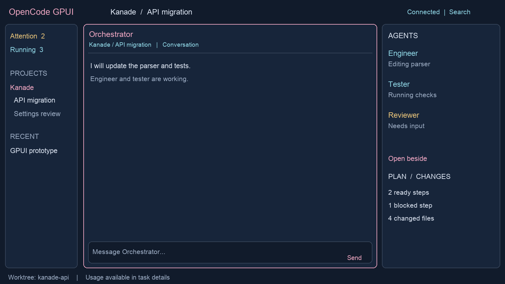
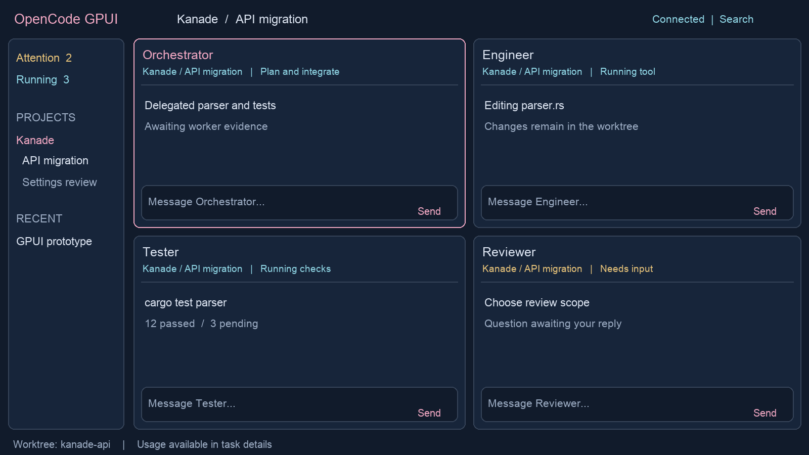

# OpenCode GPUI Design Specification

*Native Rust desktop workspace for agent orchestration*

Version 0.1  |  5 October 2026  |  Proposed implementation baseline

### Purpose

Build a personal desktop replacement for OpenCode using Rust and GPUI. The interface brings conversations, parallel agents, workplans, approvals, and code review into one workspace. Split panes are a core interaction, allowing the user to follow several agents without losing the parent conversation.

The proposed architecture retains the existing OpenCode service as the execution backend. Rust owns the native interface and client state. Existing agents, tools, models, permissions, and Shiori workplans remain part of the working system.

### Design commitments

- Make current work and requests for attention visible without opening every transcript.

- Support two panes early and extend the same layout model to three columns and a four-pane grid.

- Preserve the Hoshino aquarium identity through navy surfaces, pink selection, cyan activity, and optional wallpaper.

- Keep session state truthful across interruptions, reconnection, sleep, and app restarts.

- Make keyboard operation, readable text, and reliable composition first-class requirements.

### Initial scope

The first release targets macOS and local development. It includes project navigation, conversations, agent supervision, permissions and questions, Shiori plan visibility, and code-change review. Prototype gates establish GPUI usability and backend compatibility before broader implementation.

### Deferred scope

A full editor, embedded terminal, automatic merging, a new autonomous scheduler, remote access, multiple desktop windows, and other operating systems follow daily-use validation. The existing desktop remains available during development.

## 1 Workspace structure

The default workspace contains a project sidebar, a tabbed pane area, and an optional agent inspector. Navigation is stable while agent activity changes. The active project, task, and worktree remain visible in the top bar.

*Figure 1  Default workspace concept with illustrative agent activity*

| Region | Behavior |
| --- | --- |
| Project sidebar | Projects and sessions, plus Attention and Running filters. Counts reflect backend state and show staleness when disconnected. |
| Pane area | Conversation, plan, activity, and review tabs. Each leaf of the split layout hosts a tab group. |
| Agent inspector | Child sessions, role, model, activity, last outcome, and actions. Open beside adds an existing session to a pane. |
| Composer | Visible recipient, draft, attachments, agent and model choices. Send applies to that session only. |
| Status area | Connection and worktree context. Usage details are available without permanently occupying transcript space. |

### Progressive disclosure

Collapsed tool cards show the tool name, state, elapsed time, and a short summary. Expand to inspect arguments and results. Questions and permission requests remain actionable in context and in the attention inbox. Raw logs stay available behind a details action.

## 2 Split panes and composition

A pane is a view, not an execution unit. Opening an agent beside another agent reuses its existing session and never starts a new run. All panes use one shared client store and one event subscription per backend connection.

*Figure 2  Four pane supervision concept with explicit message recipients*

### Layout contract

- Provide split right and split below, draggable dividers, tab movement, and drop previews. Two columns, three columns, and a 2 by 2 grid are presets over the same split tree.

- Start with a supported maximum of four visible panes. Proposed minimum pane size is 360 by 280 logical pixels. Reject an extra split that cannot fit and offer opening a tab instead.

- When the window becomes too small, preserve the saved split tree and show the focused pane with a pane switcher. Restore the arrangement when space returns.

- Each pane retains its scroll anchor, selected tab, expanded tools, and unread position. A temporary maximize action preserves the underlying layout.

### Draft and focus contract

Drafts belong to the session; scroll and view state belong to the pane. If the same session is open twice, only one composer is active at a time. Moving composition to the other pane transfers the draft and focus. The recipient is visible beside Send; no broadcast-send action is included.

Follow mode may switch the selected agent in an inspector pane. A nonempty draft pins its current session until sent, saved and explicitly switched, or discarded. Closing a pane preserves drafts and never interrupts execution.

## 3 Agent supervision and attention

The agent panel answers who is working, what they are doing, where their work lives, and what requires a decision. Default ordering places requests for attention first, then active agents, then recent idle agents. Users can pin a stable ordering for supervision.

| State dimension | Values and meaning |
| --- | --- |
| Execution | Running, idle, interrupted, failed, or unknown. Idle means the turn is not executing; it does not prove the assigned work is finished. |
| Current activity | Responding, running a tool, waiting for a permission, or waiting for an answer. Show the observation time and use unavailable when unsupported. |
| Workplan status | Ready, blocked, in progress, complete, or cancelled, mapped from authoritative plan data. Keep separate from execution state. |
| Connection freshness | Live, reconnecting, or stale. Disconnection does not mark agents failed or complete. |

### Agent actions

Inspect opens the transcript. Open beside targets a new or existing pane. Interrupt stops the active turn while preserving session history and existing edits; an acknowledgement is required before showing success. Continue targets the same session using a backend-supported operation and makes the new instruction visible in its history.

Stopping one agent must not imply that its descendants or the orchestrator also stop. A later Stop group action requires an explicit scope preview and backend support. Independent scheduling remains with the existing orchestrator in the first release.

### Attention inbox

Collect permission requests, questions, execution failures, and review requests with a project, session, request ID, timestamp, and clear next action. Deduplicate by backend identity. A resolved request disappears from the actionable count but remains in the transcript. An already-resolved response refreshes state and explains that no new action was applied.

### Primary supervision flow

Open the parent task, inspect its children, then drag the engineer and tester into adjacent panes. Keep auto-follow enabled on the tester while reading an earlier engineer message. When the reviewer asks a question, its header and the inbox indicate attention without stealing focus. Open the request, answer in that session, and return to the previous pane arrangement.

### Review and ownership

Display worktree and branch context alongside changes. File attribution is shown only when supported by recorded evidence. When agents share a worktree, label the diff as shared; do not infer exclusive ownership from which agent is currently selected.

## 4 Visual system and accessibility

The appearance extends the existing Hoshino aquarium theme. Wallpaper gives the workspace its identity, while reading surfaces provide stable contrast. The first release uses a bundled or user-selected image with a dimming overlay; native background blur is optional and depends on the prototype.

| Token | Initial value | Use |
| --- | --- | --- |
| Canvas | Navy #111B2B | Workspace background |
| Selection | Pink #EFA7C2 | Active pane and selected navigation |
| Activity | Cyan #8FD5E4 | Running indicators and activity emphasis |
| Attention | Gold #E6C279 | Pending decisions with labels and icons |
| Surface | Navy with stronger opacity | Transcripts, code, menus, and diffs |
| Spacing | 4, 8, 12, 16, 24 px | Layout rhythm in logical pixels |
| Typography | 14 px body and code baseline | User-adjustable text size and line spacing |
| Pane border | 1 px, stronger when focused | Keyboard focus and pane boundaries |

### Reading behavior

Use selectable text, readable Markdown tables, horizontally scrollable code blocks, and explicit copy controls. Auto-scroll only while the reader is following the end of the transcript. Scrolling upward pauses following and reveals a new-output badge. Preserve a message-based anchor when history is loaded or content reflows.

### Keyboard behavior

Expose all pane operations in a command palette. Proposed defaults are Command K for the palette, Command Backslash for split right, Command Shift Backslash for split below, and a configurable shortcut for cycling pane focus. Confirm conflicts with macOS and text input during the prototype. Command Enter sends; Enter inserts a newline by default.

### Accessibility requirements

- Convey running, failed, and waiting states with text or icons as well as color. Validate text contrast with wallpaper at every supported opacity.

- Support keyboard navigation, visible focus, labelled controls, text scaling, reduced motion, and an opaque appearance mode.

- Test VoiceOver semantics and IME composition in Phase 0. Text input events during composition must never trigger sending.

- Keep status announcements concise. Streaming tokens must not produce continuous screen-reader announcements.

## 5 Architecture and integration

The desktop is a Rust GPUI application connected to the OpenCode V2 HTTP API. A small backend plugin exposes structured orchestration data that is absent from the native contract. Networking and parsing run away from the rendering thread; bounded messages update a shared domain store.

| Component | Responsibility |
| --- | --- |
| app | GPUI shell, panes, navigation, transcript rendering, focus, and platform integration. |
| opencode client | Authentication, typed requests, event decoding, connection lifecycle, capability checks, and errors. |
| domain | Normalized session and request state, reducers, command routing, identity, and view projections. |
| local persistence | Drafts, layout, settings, and disposable cache. Never authoritative execution or plan state. |
| orchestration plugin | Structured RPC for supported agent summaries, plan access, and usage data. Existing backend rules remain enforced. |

### Authority and identity

OpenCode owns sessions, messages, execution, and permission requests. Shiori owns durable plan state and its recovery protocol. The client owns presentation and local drafts. Use a backend instance ID, canonical project or location reference, and session ID as the context key; a display title is never an identity.

Represent agent definitions, sessions, execution attempts, workplan steps, and panes separately. A plan step may reference multiple attempts. A pane references a session or document view. This avoids equating a tab closure, a finished turn, and a completed task.

### Plugin boundary

Prefer native API methods before adding RPC. Candidate custom methods include an agent summary snapshot, plan inspection, plan mutation through the existing permission bridge, and usage summary. These names describe proposed capabilities rather than existing endpoints. Each mutation validates project context, caller authority, and stale-state preconditions.

The current subagent-control plugin exposes model-facing tools with formatted text. Reuse its underlying logic through structured contracts where needed; do not scrape its output. Shiori integration must retain exact-resource permission checks, expected hashes, locks, and recovery handling.

### Dependencies

Evaluate GPUI Kit for inputs, menus, docking, and tables. Keep the shell and agent views custom. Pin a compatible GPUI and component-library pair and a tested OpenCode contract version. Start with three Rust crates and one small backend adapter; avoid a general plugin framework for the desktop.

## 6 Synchronization and lifecycle

The documented OpenCode V2 event stream is live-only, with no replay or automatic reconnection. Treat events as updates to a recoverable view. The client must reconstruct its state from authoritative API reads after a stream failure or backend restart.

### Connection sequence

- Discover or select a backend, authenticate, inspect its version, and verify supported capabilities before enabling actions.

- Subscribe and buffer events while loading project, session, message, active-run, and pending-request snapshots. Reconcile with stable IDs and revisions where available.

- If the API cannot provide an atomic snapshot or comparable revisions, re-fetch affected entities after buffered events and expose freshness until reconciliation completes.

- On disconnect, preserve visible content and drafts, mark it stale, and reconnect with bounded exponential backoff and jitter. Refresh again after sleep or application focus.

- Handle duplicate, unknown, delayed, and out-of-order events without inventing state. An overflow triggers resynchronization instead of silently dropping critical updates.

### Command delivery

Generate a client operation ID and use backend idempotency only if supported. On an ambiguous timeout, show delivery unknown and query authoritative state before offering a retry. Never automatically re-send a prompt or approval solely because its response was lost. A command is successful only after acknowledgement or authoritative reconciliation.

### Process ownership

Attach to the existing service by default. If the app starts a service, record that ownership separately from the endpoint. Closing the window leaves active work running. Explicit backend shutdown identifies affected work and uses a verified service operation; do not terminate a process merely because it occupies an expected port.

### Permissions and local storage

The permission panel shows the backend request, target resource, project, and affected session. Choices match backend semantics. Expired, denied, and already-settled responses stay distinguishable. Protect service credentials using supported platform facilities and redact them from diagnostics. Cache only the minimum content needed for responsiveness; drafts must survive a crash.

### Failure and removal cases

A missing or archived session remains visible as an unavailable pane with options to reopen navigation or close the pane. Deleted worktrees disable actions that depend on them. A backend version mismatch offers an explicit compatibility message. A corrupt saved layout falls back to one pane while preserving recoverable drafts. Missing usage metrics display unavailable rather than zero.

## 7 Delivery plan and release gates

Delivery proceeds through working vertical slices. Each phase ends with a demonstrated user workflow and a compatibility record. Schedule estimates should follow the first prototype, particularly its text-input, accessibility, and streaming results.

| Phase | Deliverable | Exit evidence |
| --- | --- | --- |
| 0  Feasibility | GPUI window, connection, transcript stream, composer, permissions, basic text and accessibility checks. | One real task works; reconnect restores state; IME and VoiceOver gaps are recorded. |
| 1  Conversation and splits | Navigation, tool cards, two panes, independent scrolling, drafts, model choices, initial theme. | An ordinary coding task is completed inside the app; closing a pane leaves execution intact. |
| 2  Supervision | Three-column and four-pane presets, draggable layouts, agent activity, attention inbox, interrupt and continue. | Several agents can be supervised without routing a message to the wrong session. |
| 3  Plans and review | Shiori views, supported plan actions, dependencies, worktree context, diffs, validation evidence. | One task is followed from plan to reviewed changes with evidence linked to its steps. |
| 4  Daily use | Recovery, performance, accessibility fixes, diagnostics, packaging, install and fallback procedure. | Sleep, restart, long history, backend failure, and layout restoration pass the agreed checks. |

### First milestone demonstration

Open an existing project; send a task; open a child agent beside the parent; answer a permission request; scroll one pane without moving the other; interrupt the child; close and reopen the app; recover the layout and accurate backend state. Record the exact GPUI, component-library, and OpenCode versions used.

### Release boundaries

Run the new client alongside the existing desktop during validation. Do not migrate or rewrite the existing session database. Distribution signing, packaging, and update behavior belong to Phase 4. Cross-project supervision and remote services follow a reliable local release.

## 8 Verification and acceptance

The following are proposed release criteria, not measured results. Establish a named reference Mac, build configuration, fixture set, and instrumentation in Phase 0, then retain those conditions for comparisons.

| Area | Acceptance scenario |
| --- | --- |
| Pane independence | Four visible sessions stream concurrently. Reading older text in one pane does not change another pane or steal keyboard focus. |
| Message routing | Each send reaches the displayed session. Follow mode and duplicate-session panes cannot silently redirect a nonempty draft. |
| Recovery | Disconnect during output and during an approval. Reconnect restores messages, active state, and pending requests without duplicate side effects. |
| Interruption | Interrupt one child. Its edits and history remain, unrelated sessions continue, and its plan step is not automatically marked complete. |
| Plans | Two clients act on a plan. The stale mutation is rejected or reconciled through Shiori, with no direct file overwrite. |
| Lifecycle | Close a pane and quit the UI during execution. Reopening restores drafts and layout while reflecting the actual backend run state. |
| Accessibility | Complete composition, pane switching, approval, and interruption using keyboard navigation; verify IME and VoiceOver behavior. |
| Performance | With four panes and a 10,000-message history fixture, local input feedback has p95 latency below 100 ms; scrolling targets 60 fps on the reference machine. |

### Test layers

Use unit tests for reducers, identity, draft routing, layout persistence, and command outcomes. Use contract fixtures for API and RPC decoding, unknown event types, and missing fields. Run integration tests against a pinned OpenCode build for real permissions, interruptions, and reconnection. Use GPUI interaction tests and manual visual checks for focus, selection, resizing, and text input.

### Load and observability

Measure frame time, event backlog, reconnect duration, memory, and time from input to visible feedback. Coalesce rendering updates while preserving semantic events. Virtualize histories and bound diagnostic buffers. A sustained replay should stabilize rather than retaining every rendered message or event indefinitely. Diagnostic export must omit credentials and require deliberate inclusion of transcript content.

## 9 Decisions and references

### Requested product requirements

Rust with GPUI; an OpenCode desktop replacement centered on agent orchestration; a familiar desktop workspace with a personal Hoshino visual identity; and split screens for following multiple agents at once.

### Proposed defaults to validate

macOS first; existing OpenCode service retained; one window with up to four visible panes; two-pane support in Phase 1; session-owned drafts with a single active composer; existing orchestrator retained as scheduling authority; optional wallpaper and opaque reading surfaces. These defaults form the initial design baseline and can change after prototype use.

### Prototype questions

- Can the chosen GPUI and component-library versions meet text selection, Markdown, IME, focus, and VoiceOver needs without extensive custom work?

- Which session, interruption, permission, discovery, and event contracts are supported by the exact installed OpenCode build?

- Can current Shiori operations be exposed through authenticated structured RPC while preserving the existing host permission bridge?

- Does a four-pane layout remain useful at the user’s normal window size, or should a transcript plus compact agent views be the preferred preset?

### Source register

Official project references checked during planning on 5 October 2026. External documentation describes the current published interface; the installed version must be verified before implementation. The screenshot supplies visual direction, not implementation instructions.

[GPUI framework and examples](https://gpui.rs/)

[GPUI Kit components](https://gpui-kit.com/)

[OpenCode V2 client and event subscription behavior](https://opencode.ai/v2/docs/build/client/)

[OpenCode V2 API reference](https://opencode.ai/v2/docs/api)

[OpenCode V2 plugin RPC contracts](https://opencode.ai/v2/docs/build/plugins/rpc/)

Local implementation references: desktop-themes/hoshino/README.md; packages/subagent-control/src/index.ts, list.ts, and stop.ts; vendor/shiori/README.md; packages/subagent-control/package.json. Paths are relative to the OpenCode configuration repository.

Compatibility evidence: local theme notes record desktop 2.0.22, while relevant plugin dependencies pin 2.0.20. Validate the installed runtime and plugin contracts together during Phase 0.
